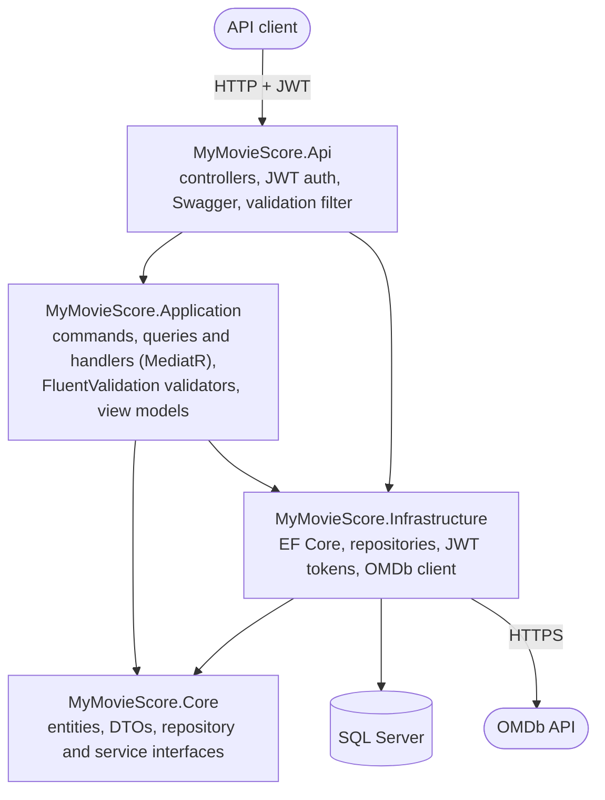
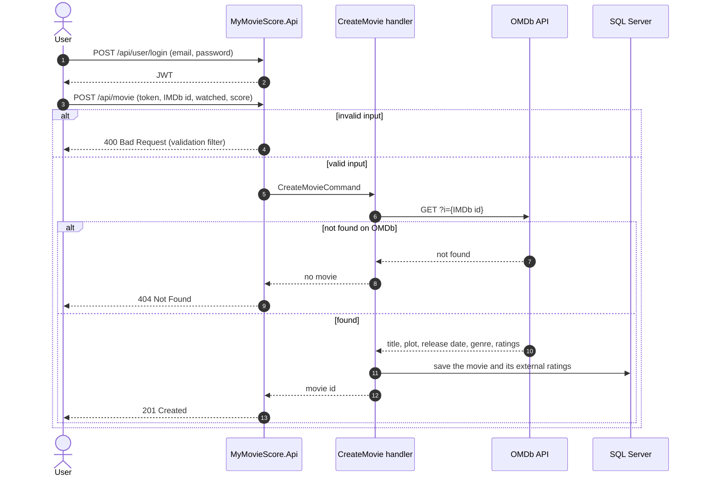

# MyMovieScore

[](https://github.com/joaogqueiroz/MyMovieScore/actions/workflows/ci.yml)

A REST API where people sign up, save movies to a personal list and rate them. When a movie is added by its IMDb id, the API looks it up in the [OMDb API](https://www.omdbapi.com/) and stores its title, plot, release date, genre and external ratings.

Built with ASP.NET Core 8 using CQRS with MediatR and a clean-architecture layout.

## Architecture



- **CQRS:** every write is a command (`CreateUser`, `LoginUser`, `CreateMovie`, `UpdateMovie`, `DeleteMovie`) and every read is a query, each with its own handler.
- **Auth:** JWT bearer tokens; the movie endpoints require a token.
- **External data:** `IMDbExternalService` fetches movie details and ratings from OMDb when a movie is created.
- **Migrations:** pending EF Core migrations are applied automatically on startup.

## Adding a movie



## Endpoints

| Method | Route | Auth | Body or parameters |
| --- | --- | --- | --- |
| POST | `/api/user` | | `{ "email", "password", "name" }` |
| POST | `/api/user/login` | | `{ "email", "password" }` → returns a JWT |
| GET | `/api/user/{id}` | | |
| POST | `/api/movie` | token | `{ "userId", "idIMDb", "watched", "userScore" }`, e.g. `"idIMDb": "tt0111161"` |
| GET | `/api/movie` | token | |
| GET | `/api/movie/{id}` | token | |
| PUT | `/api/movie` | token | `{ "id", "watched", "userScore" }` |
| DELETE | `/api/movie?id={id}` | token | |

Swagger UI is available at `/swagger`. The `MyMovieScore.postman_collection.json` file has ready-made requests for Postman.

## Tech stack

C# · .NET 8 · ASP.NET Core · Entity Framework Core · SQL Server · MediatR · FluentValidation · JWT · OMDb API · Swagger · Docker Compose

## Running locally

Requirements: Docker and a free OMDb API key from https://www.omdbapi.com/apikey.aspx.

```sh
cp .env.example .env   # then put your OMDb key in .env
docker compose up -d --build
```

This starts SQL Server and the API, applies the migrations and serves the API at http://localhost:5000 (Swagger at http://localhost:5000/swagger). Inside Docker the API reaches the database by its service name, `sqlserver`.

To run the API with `dotnet run` instead, start only the database with `docker compose up -d sqlserver`. The connection string in `appsettings.json` points to `localhost,1433`.

The API reads the OMDb key from `ExternalService:Key`, which is empty in `appsettings.json`. Docker Compose fills it from `OMDB_API_KEY` in `.env`, which git ignores. With `dotnet run`, set it as a user secret:

```sh
dotnet user-secrets set "ExternalService:Key" "<your-key>" --project MyMovieScore.Api
```
